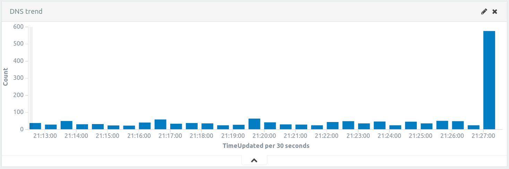
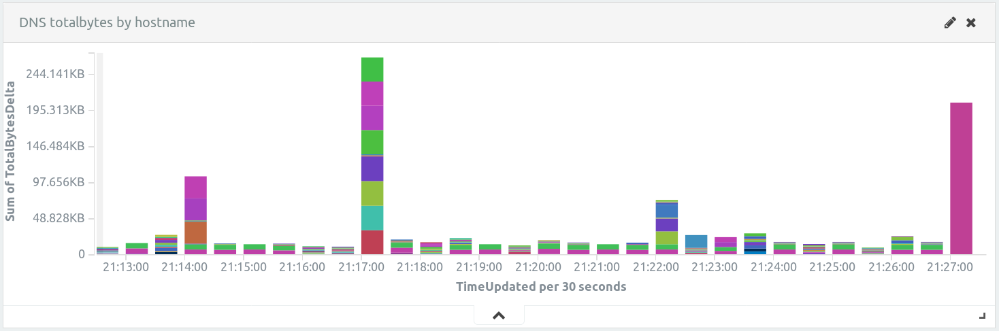
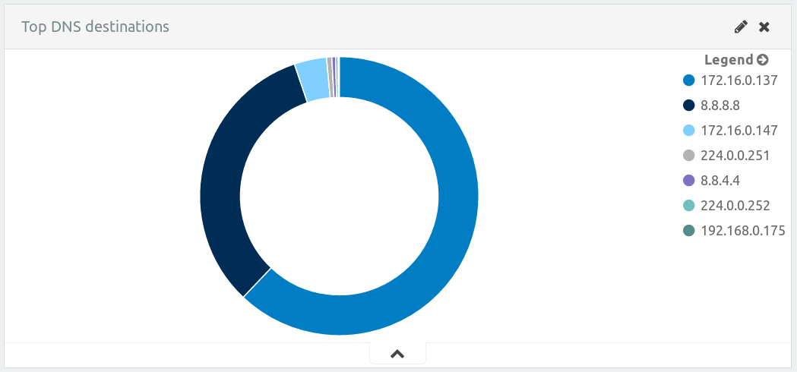
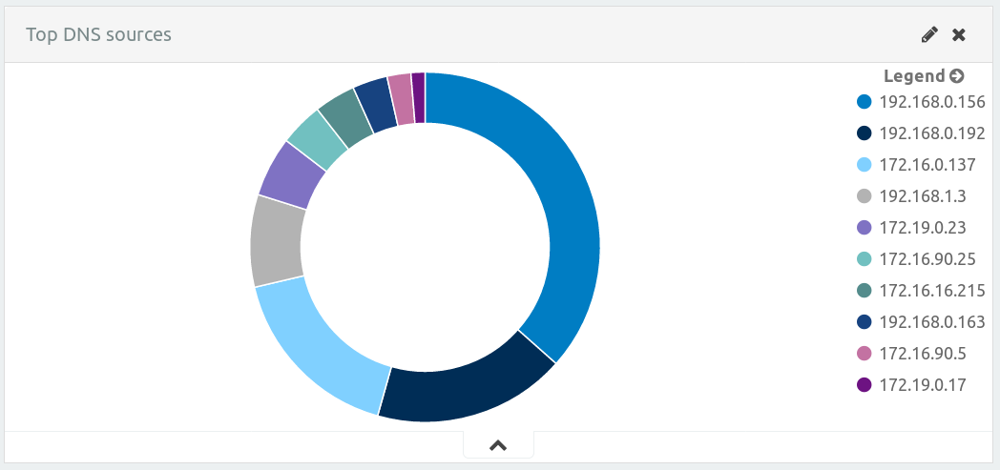
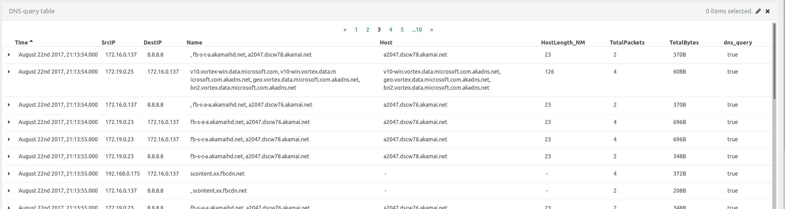

# Purpose
In the last few years we have seen big data leaks from companies and
government along where personal information and intellectual property
has been exposed. There are a myriad of ways to extract data from
networks nowadays that is why the common trend in enterprise networks is to
block data transfer sites or applications like dropbox, drive, etc or protocols
such as ftp, sftp, etc, specially if the users of a specific network do
not need to transfer things. However, there is often some standard protocols
that are left wide open without any deep packet inspection such as DNS or ICMP
that are often leveraged by malicious actors that use them for different
purposes like C&C or data exfiltration/infiltration.

As the name suggests we will use this dashboard to hunt for leads pointing
to a possibly DNS data exfiltration/infiltration, since you probably know
DNS is one of the noisiest protocols with a lot of packets specially in
end users networks, hence it is almost impossible to review DNS logs manually.

This dashboard will help us to establish a trend for a specific environment
and detect outliers that can possible identify DNS misuse like using the
protocol to exfiltrate data or to infiltrate binaries, scripts, etc, to our
internal networks in an attempt to evade other controls in place.

# Manifest
These are all the files that are needed to be able to use this dashboard:
- Flow_DetectDNSLength.lua: this rule will help us to identify very large
   host records with the exact same length, sadly at the moment NM does not
   allow us to set the data type for the custom fields, this is why
   we can not use this custom field (HostLength_NM) with the aggregation
   functions in the visualizations since is stored as a string variable,
   however it stillserves a purpose on the query table to show the length
   of a specific DNS host record.
- dashboards.json: this file contains the DNS Exfil/Infil hunting dashboard.
- visualizations.json: there are different visualizations that help us to
  identify a possible data exfiltration or infiltration:
  * DNS trend: the trend histogram will help us to define a standard
    behavior for a specific environment over time allowing us to identify
    an abnormal behavior like high dns packet count on a very small amount of
    time.
    
  * DNS totalbytes by hostname: this graph show us the total amount of bytes
    sent to a specific hostname, having a big spike on one foreign hostname
    for a specific environment should raise suspitions and will need to be
    investigated.
    
  * Top DNS destinations: this graph presents the top ten destinations for
    DNS traffic, this graph is useful once we start to drill down on a specific
    time frame while researching a suspicious behaviour since it will show if
    there are per example hosts speaking with unauthorized (by company rules)
    DNS hosts.
    
  * Top DNS sources: this top ten graph will have our internal hosts that generate
    more DNS traffic, the participation of a specific host will be out of
    proportion if DNS is used to exfiltrate or infiltrate any kind of file since
    this require a lot of traffic to be generated due to the space constraints
    and the need to encode the files.
    
  * DNS query table: this table contains the results for any traffic defined as DNS
    this table has different fields that are relevant for the type of problem we are
    trying to tackle.
    
- searches.json: this is just a lucene query searching for any hits on DNS
  application type, all our visualizations are built around this query.

Also there are some pcap files to test the dashboard:
- evidence/dns-infil.pcap: this packet captures contains all the traffic generated
  while we were infiltrating a custom PE32 executable via DNS queries.
- evidence/dns-exfil.pcap: this is the traffic generated while we were exfiltrating
  a small document in OpenDocument Text format (ODT) via DNS queries.

All the files in the imgs folder are just illustrations for the different visualizations
in the dashboard:
- dns-trend.png
- query-table.png
- tbytes-hostname.png
- top-destinations.png
- top-sources.png

# Dependencies
There are no special requirements to setup this dashboard.

# Setup
The following steps are required to import the dashboard and its components:

1. First of all we will import a DPA rule to add the DNS host record response
   this is the file *Flow_DetectDNSLength.lua*.
2. After having our DPA rule in place we will need to import our custom search,
   you can do this by importing the *searches.json* file.
3. Import the visualizations file *visualizations.json* this file has the
   definition for our different visualizations.
4. With all these components already working we can import the *dashboard.json*
   file, this will create our DNS Exfil/Infil dashboard.

